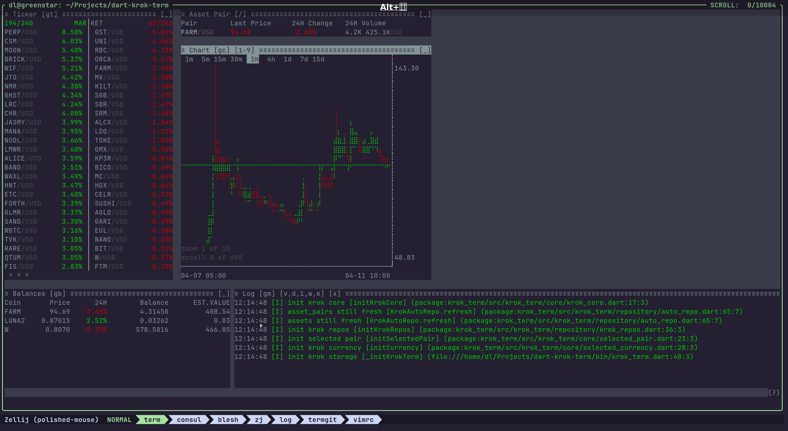
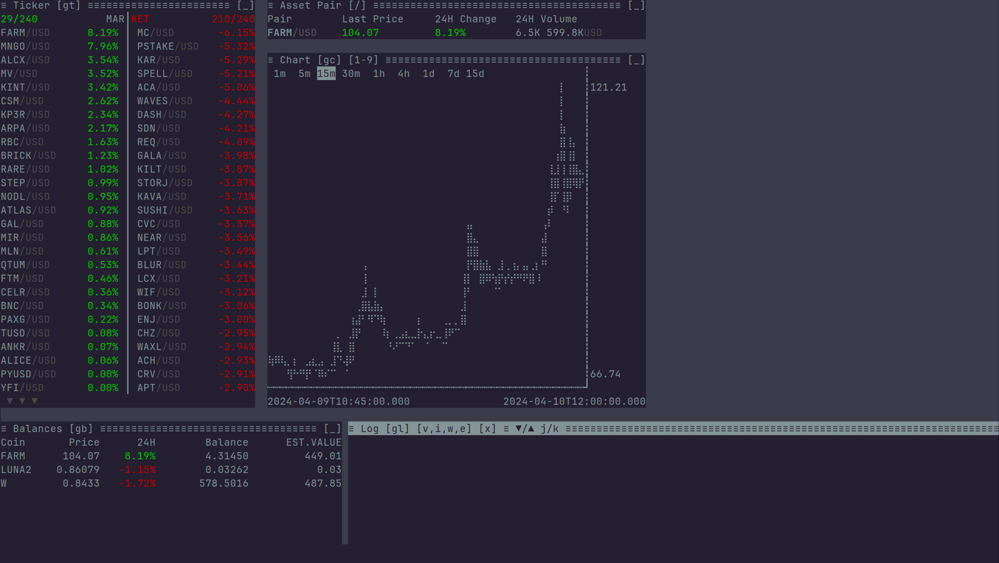

## Krok Term - Kraken Crypto API TUI

Another project from my "Learn me some Dart" phase.

After implementing a Kraken Crypto API that I named [krok](https://pub.dev/packages/krok) for no good reason, I
started implementing a simple TUI "desktop system". Also in Dart. This one is called
[consul](https://pub.dev/packages/dart_consul).

This now in front of you is the obvious conclusion... 🙃

### What is this?

Basic alternative to the Kraken Web Interface. Allows running this in screen/tux/... session on a server. That's
what I do. Or locally on your machine in a terminal. Because that's fun and cool. Right? 🙃

The neat thing, to me, are the shortcuts. You can just type "gb" to go to the balances window. Inside a window you
can scroll up/down via j/k like a real vim pro. You can jump into the asset pair selection from everywhere via / and
start typing to filter. Then press enter to select it.

### Example Screenshot

Screenshot of the app running:

Animation of the app running:

### To Do

These are really "maybe"s only, depending on how much time I find.

- Separate logs for domain vs debug
  - Make DebugLog reusable? Multiple instances?
  - How to redirect logs from krok to file only?
- Open orders, closed orders, current and all pairs
- Add alert
- Show alerts, current and all pairs
- Remove alert or all alerts (current pair vs all pairs)
- Place basic order
- Place complex order
- Cancel order, Cancel all
- Panic button (Sell all limited)
- Investigate how to retrieve margin info
- Market crawler to give decision suggestions (no AI, just some math)
- Simple auto trading bots
- AI
- Other exchange(s)
